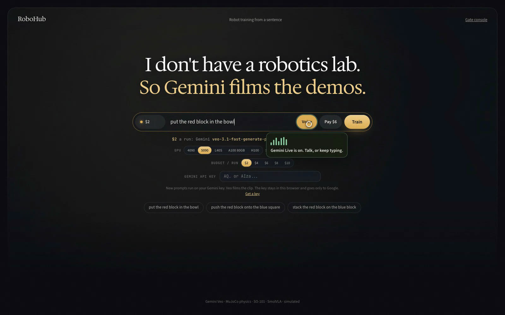
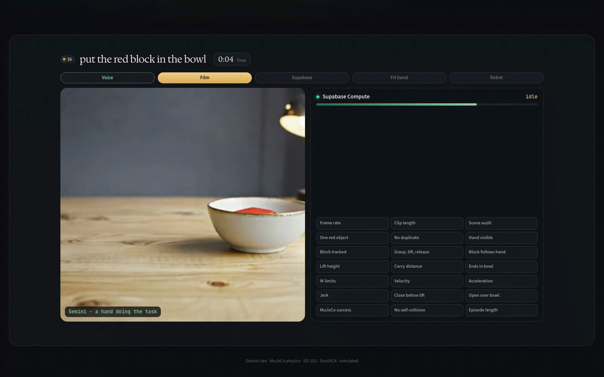
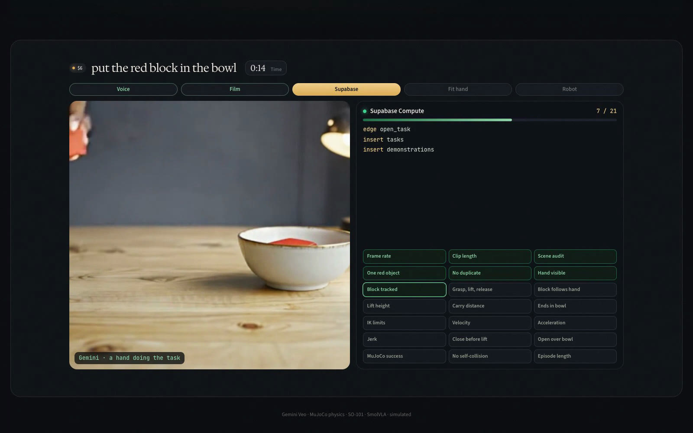
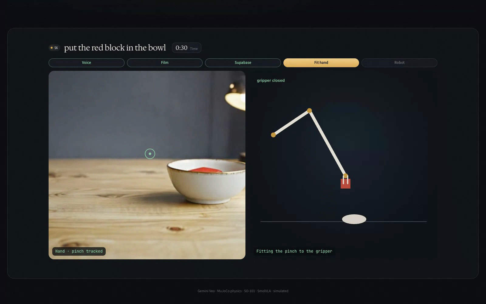
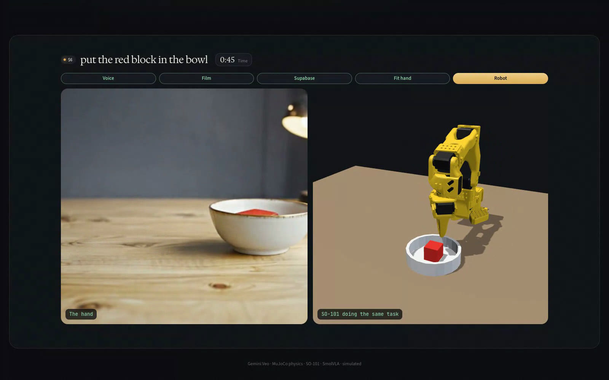
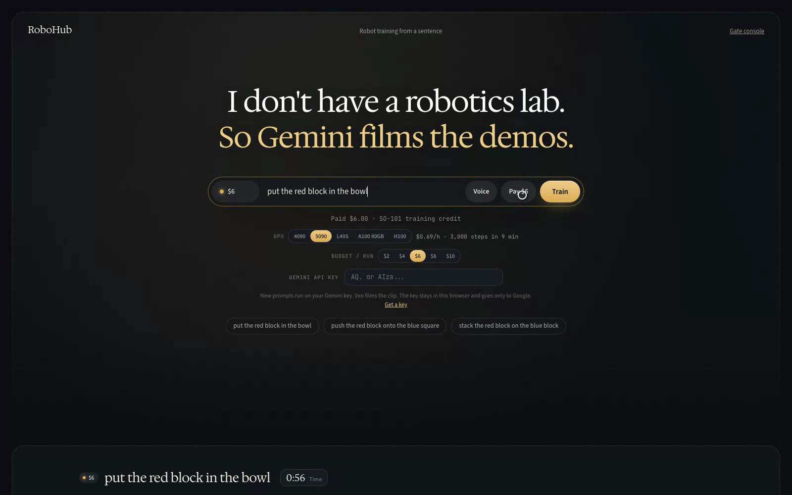

# RoboHub

Type a sentence. A robot learns it.

**Live:** https://robohub-azure.vercel.app

You type the task, or you press **Voice** and say it. Gemini films a hand doing the job. Supabase checks the clip. The hand is fit onto a robot arm. The arm does the same thing in simulation.

## What you see

**1. Talk or type.** Voice is Gemini Live. Speak the task, or keep typing.



**2. Gemini films a hand.** Veo makes a short clip of a person doing the task. Nobody is in a lab.



**3. Supabase does the checking.** It writes the row, runs 21 physics gates, and marks each one as it finishes.



**4. The hand is fit onto the gripper.** The pinch point becomes the robot's fingers.



**5. The robot does the task.** An SO-101 arm runs the same motion in MuJoCo.



**6. A run costs $6.** Stripe takes the payment. The site is on Vercel.



## The path

```text
sentence → Gemini film → Supabase gates → fit the hand → SO-101 sim → SmolVLA
```

What passes the gates is saved as a LeRobot dataset. SmolVLA trains on the cameras, the arm joints, and the original sentence.

## Run it

Hosted site, no install: https://robohub-azure.vercel.app

Local:

```bash
uv sync
cp .env.example .env
bin/robohub serve
```

Put `GEMINI_API_KEY` in the environment. Apply `supabase/migrations/001_rohub_schema.sql` once. Gate details are in [docs/DATA-SPEC.md](docs/DATA-SPEC.md).

One command for the full local pipeline:

```bash
bin/robohub run "put the red block in the bowl"
```

This is simulation. The arm on the page is MuJoCo, not a physical robot yet.
