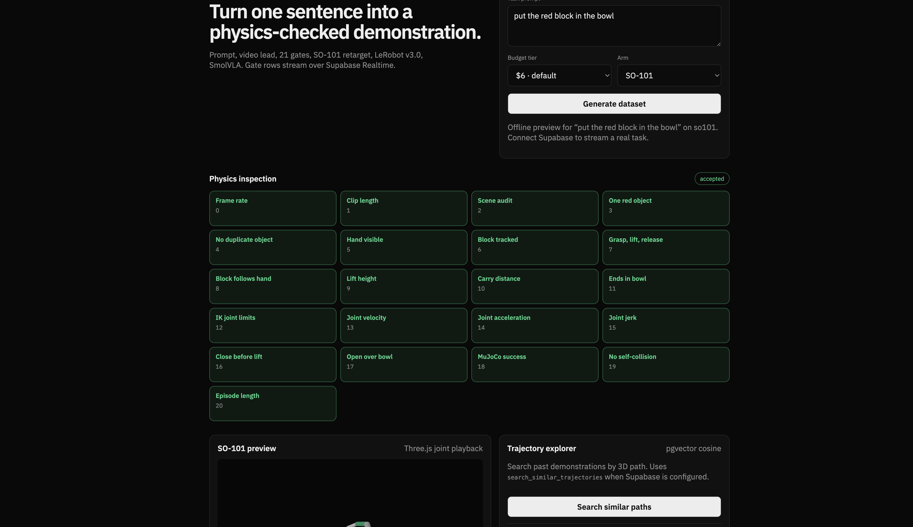
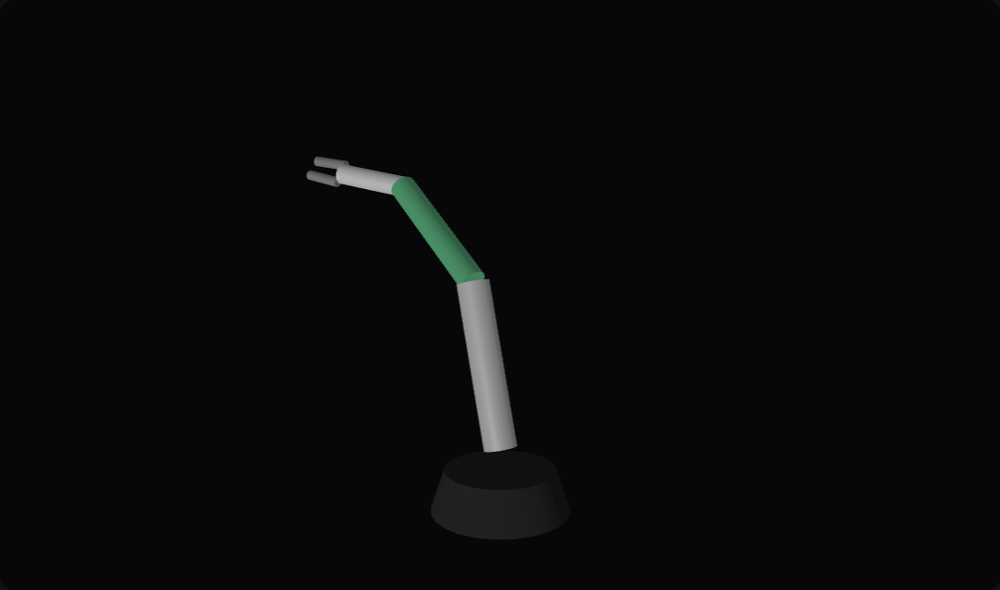

# RoboHub

**RoboHub: Text-to-Policy Engine for Physical AI with Supabase & MuJoCo.**

RoboHub is an open physical-AI data platform. One text prompt becomes a physics-verified robot demonstration dataset, then a Vision-Language-Action policy (SmolVLA) for a low-cost SO-101 arm. Supabase stores run state, gate audits, artifacts, and 3D trajectory embeddings.

Adapted from [understudy-replay](https://github.com/PranavAchar01/understudy-replay). The pipeline idea is the same. The product is a data platform: every clip, gate, and checkpoint is a row or an object in Supabase.

## Architecture

```text
Text Prompt
    -> Video Lead
    -> Physics Audit & Gates
    -> SO-101 Retargeting
    -> LeRobot v3.0 Dataset
    -> SmolVLA Training
    -> WebAssembly Preview
```

1. **Text prompt.** A task sentence and a budget tier enter the planner. The planner checks whether the scene is feasible for an SO-101 and splits the budget across clips.
2. **Video lead.** A video model films a person doing the task. Nobody teleoperates the arm.
3. **Physics audit and gates.** MediaPipe tracks the hand. OpenCV tracks the object. A scene auditor counts objects and checks frame integrity. Twenty-one gates then reject clips a robot should not learn from (IK limits, jerk, duplicates, grasp order).
4. **SO-101 retargeting.** MuJoCo 3 inverse kinematics maps the pinch path onto the SO-101. Only episodes that survive physics stay.
5. **LeRobot v3.0 dataset.** Accepted episodes export as parquet in LeRobot dataset v3.0, with front and wrist cameras.
6. **SmolVLA training.** A worker watches the Supabase `tasks` queue. When enough clips pass, it trains SmolVLA on RunPod and writes checkpoints plus eval rollouts to Storage.
7. **WebAssembly preview.** The web app streams gate telemetry over Supabase Realtime and plays retargeted joint motion in a MuJoCo / Three.js viewer.

## Layout

| Path | Role |
|---|---|
| `src/rohub/` | Planner, tracking, gates, retarget, dataset export, Supabase client |
| `supabase/migrations/` | Postgres schema, `vector`, trajectory search |
| `vendor/so101/` | SO-101 MuJoCo model |
| `gpu/` | SmolVLA trainer and RunPod dispatch |
| `web/` | Developer dashboard |
| `tests/` | Gate and logging checks |



## Quick start

```bash
uv sync
cp .env.example .env
```

Fill `SUPABASE_URL` and `SUPABASE_SERVICE_ROLE_KEY`. In the Supabase SQL editor, run `supabase/migrations/001_rohub_schema.sql`. That enables `vector`, creates `tasks`, `demonstrations`, and `models`, and adds `search_similar_trajectories`.

```bash
# dashboard
python -m http.server --directory web 8765

# gate and logging checks
uv run pytest

# train when a task has enough accepted clips
python gpu/worker.py
```

Open http://127.0.0.1:8765. With empty Supabase env vars the page still runs: Generate replays the 21 gates locally, and Search shows sample trajectories. With keys in `localStorage` (`ROBOHUB_SUPABASE_URL`, `ROBOHUB_SUPABASE_ANON_KEY`) the same buttons insert tasks and call the pgvector RPC.

| Variable | Role |
|---|---|
| `SUPABASE_URL` | Project URL |
| `SUPABASE_ANON_KEY` | Browser reads and Realtime |
| `SUPABASE_SERVICE_ROLE_KEY` | Pipeline writes and Storage uploads |
| `SUPABASE_STORAGE_BUCKET` | Default `robohub-artifacts` |
| `RUNWAY_API_KEY` | Video lead |
| `RUNPOD_API_KEY` | SmolVLA rental |
| `ROBOHUB_MIN_ACCEPTED` | Accepted clips before training (default 4) |
| `ROBOHUB_TRAIN_STEPS` | SmolVLA steps (default 3000) |

## Benchmarks

Same task, same SmolVLA base, same 50 unseen MuJoCo starts. Numbers are from the source pipeline this repo adapts ([understudy-replay](https://github.com/PranavAchar01/understudy-replay), measured 2026-09). RoboHub did not re-train these checkpoints in this repository.

| Demonstrations | 3,000 steps | 20,000 steps |
|---|---|---|
| Generated video, 21-gate filter, SO-101 retarget | 34/50 | 43/50 (86%) |
| Scripted operator in the same sim | 44/50 | 44/50 (88%) |
| Untrained SmolVLA | 0/50 | 0/50 |

Training the 20,000-step pick policy took about 48 minutes on an RTX 5090 (about $0.55). The 95% intervals overlap the scripted operator at 20,000 steps.



## License

Pipeline code is adapted from understudy-replay. SO-101 meshes in `vendor/so101/` keep their upstream Apache-2.0 license.
