# RoboHub

**RoboHub: Text-to-Policy Engine for Physical AI with Supabase and MuJoCo.**

**Live site:** https://robohub-azure.vercel.app

**Type one sentence. Gemini films a person doing the task, physics throws out every clip a robot shouldn't learn
from, and a vision-language-action model (SmolVLA) learns the skill on a rented GPU for under $10.**

A video model films a person doing the task. Physics throws out every clip a robot should not learn from. SmolVLA trains on what remains, for a low-cost SO-101 arm. Supabase stores the task, every gate verdict, the dataset, and the checkpoint.


**Runway imagines the demonstration. Physics decides whether it counts.**

## How it works

Everything below runs in simulation. The images come from a real run of "put the red block in the bowl".

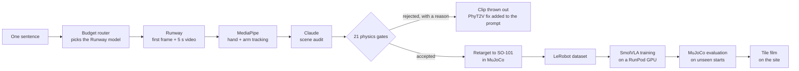

### 1. Runway films a person doing the task

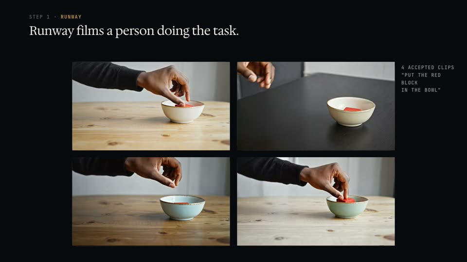

Runway draws a first frame of a table, a red block and a bowl, then animates a hand doing the task for 5 seconds.
Nobody is filmed. The budget router picks which video model makes the clip.

### 2. MediaPipe tracks the hand, frame by frame

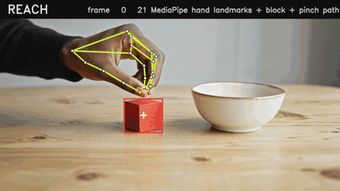

MediaPipe finds 21 landmarks on the hand and the arm pose in every frame. OpenCV finds the red block by colour.
The gold ring is the pinch point between thumb and index finger; the gold line is its path.

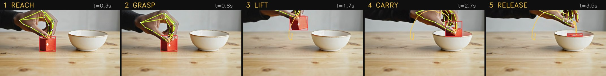

The events come from the block, not the fingers. The grasp is when the fingers reach the block just before it
moves, and the release is when the block is at rest again. The 3 cm block is the ruler: in this clip the hand lifts
it 5.2 cm and carries it 8.5 cm, and the robot copies those distances in metres.

### 3. Claude audits the scene, then 21 gates decide if the clip counts

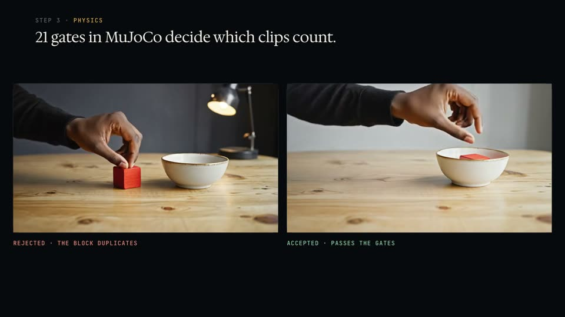

Claude counts blocks, bowls and hands in the first frame and checks the last frame. Then 21 gates run, each with
a limit and a plain reason. The clip on the left was rejected because the video duplicated the block. The one on
the right passed every gate.

| Clip side (the video) | Robot side (the replay) |
|---|---|
| frame rate, clip length, Claude scene audit | IK inside SO-101 joint limits |
| one red object, no second red object appears | joint velocity, acceleration and jerk |
| hand and wrist visible, block tracked | gripper closes before lift |
| grasp, lift and release found in order | gripper opens over the bowl |
| block moves with the hand | cube ends in the bowl in MuJoCo |
| lift at least 3 cm, carry at least 5 cm | no self-collision |
| video ends with the block in the bowl (Claude) | episode length 2 to 30 s |

A real rejection reads like this: "a second red block appears on 63 frames: the video duplicated the object".
Every limit is in [docs/DATA-SPEC.md](docs/DATA-SPEC.md).

### 4. Accepted clips are retargeted onto the SO-101 in MuJoCo

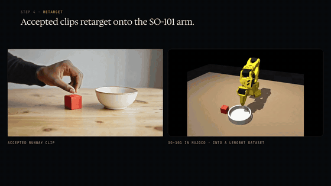

The pinch point becomes the robot's grasp point, 1:1 in metres, and inverse kinematics turns it into SO-101 joint
angles. MuJoCo replays it with physics. Only episodes where the cube really lands in the bowl are kept.

### 5. The episodes become a LeRobot dataset

Each accepted clip is also replayed with the cube shifted by up to 3 cm, and every copy goes through the same robot
gates. For this task, 4 accepted clips became 74 episodes (25,190 frames) with front and wrist cameras, in LeRobot
format v3.0.

### 6. SmolVLA trains on a rented GPU, then runs on starts it never saw

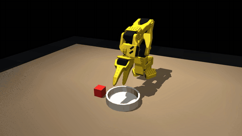

SmolVLA learns from camera images, joint angles and the sentence. The trained policy is filmed in MuJoCo, and that
film becomes the task's tile on the site. Details in [Training](#training) below.

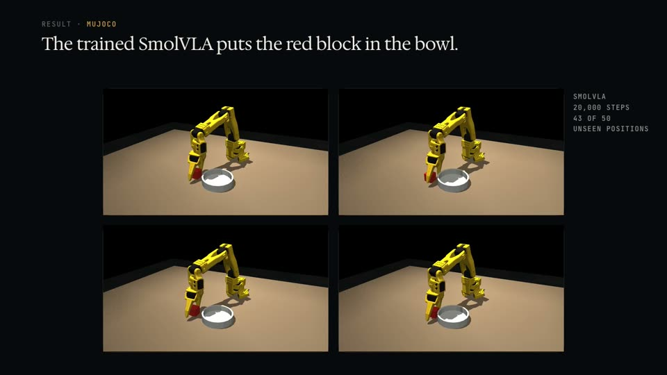

## Why

Robots learn new skills from demonstrations, and today a person records every one of them, one take at a time,
with a teleoperation rig. That is why robot learning lives in well-funded labs. RoboHub makes the
demonstrations from a sentence instead, so a student with a laptop and a $200 arm can train a policy.

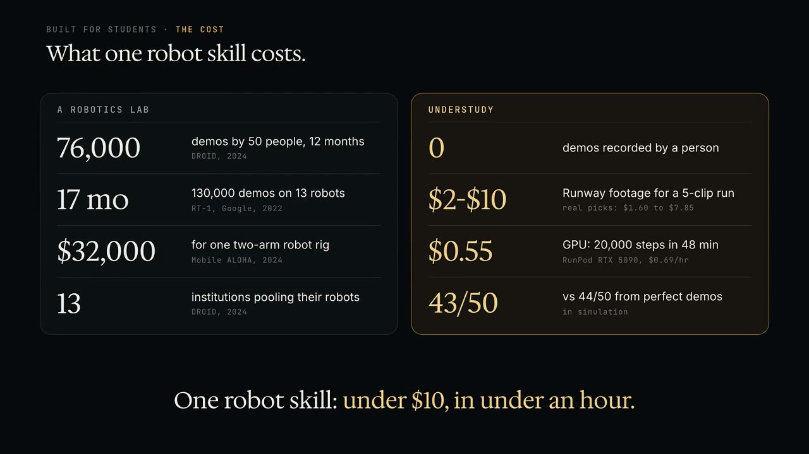

| | A robotics lab | RoboHub |
|---|---|---|
| Demonstrations | DROID (2024): 76,000 demos by 50 people over 12 months, pooled across 13 institutions | 0 recorded by a person |
| Hardware | Mobile ALOHA (2024): under $32,000 for one two-arm rig | a laptop, plus an optional ~$200 SO-101 |
| Footage | people in front of cameras | $2 to $10 of Runway video a run ($1.60 to $7.85 actual) |
| Training | a lab's own GPUs | about $0.55 on a rented RTX 5090 (20,000 steps, 48 min) |

## Results (all in MuJoCo simulation)

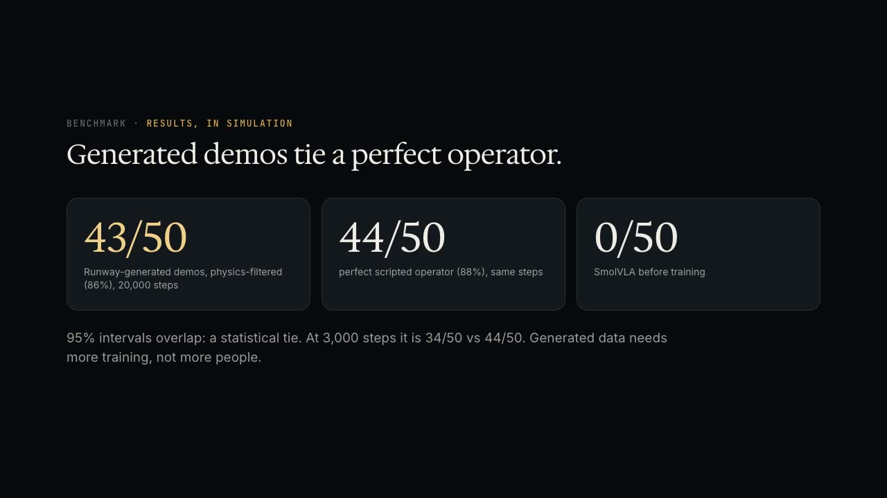

The controlled test: same model (SmolVLA, `lerobot/smolvla_base`), same task ("put the red block in the bowl"),
same 74 training start positions, same 50 unseen test positions, same training. The only thing that changes is
where the demonstrations came from.

| Demonstrations | 3,000 steps | 20,000 steps |
|---|---|---|
| Runway-generated video of people, physics-filtered | 34/50 | **43/50 (86%)** |
| A perfect scripted operator (reads the exact cube pose) | 44/50 | **44/50 (88%)** |
| Same model, untrained | 0/50 | 0/50 |

The 95% intervals overlap, so at 20,000 steps the two are statistically tied. Generated data needs more training
to catch up, not more people. The scripted operator is stronger than a human teleoperator, because it knows
exactly where the block is. Details: [docs/BENCHMARK.md](docs/BENCHMARK.md).

The other library tasks show the rest of the pipeline (routing, training, filming) on harder scenes. Their
demonstrations come from the scripted operator, not from Runway footage:

| Task | Episodes | Steps | GPU and time | Result on unseen starts |
|---|---|---|---|---|
| put the red block in the bowl (Runway demos) | 74 | 20,000 | RTX 5090, 48 min | 43/50 |
| push the red block onto the blue square | 30 | 3,000 | RTX 4090, 17.5 min | 3/5 |
| stack the red block on the blue block | 30 | 10,000 | L40S ($0.54) | 0/5 (not learned yet; its tile shows the scripted demo) |
| stack three blocks into a tower | 25 | 14,000 | L40S, 33.7 min ($0.73) | 1/5 |

## Training

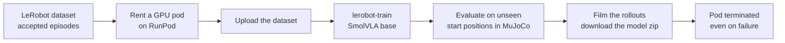

`gpu/rohub_trainer.py` does every step. You pick the GPU (4090, 5090, L40S, A100 or H100). The pod is always shut
down at the end, so a crashed run can't keep billing.

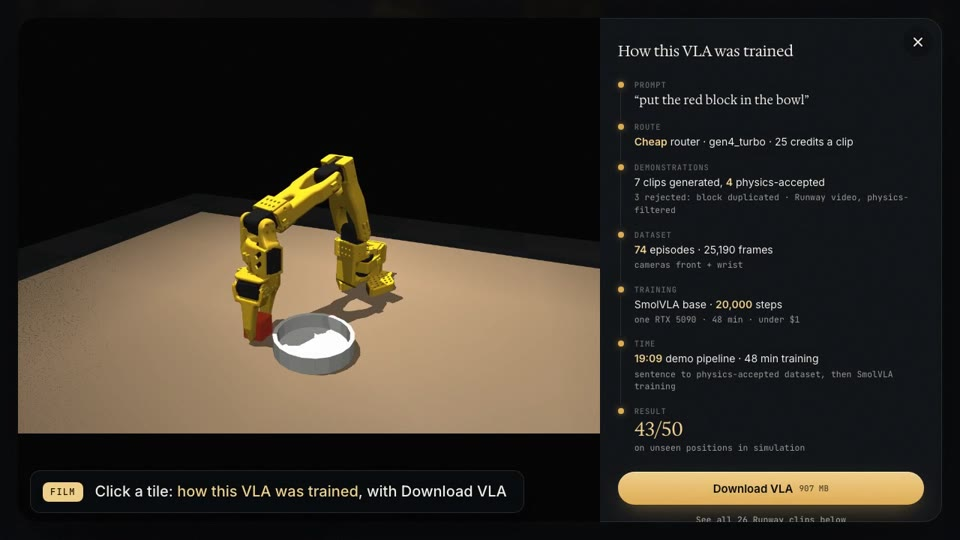

Click any tile on the site to see this card: the route, how many clips passed, the dataset, the training run and
the score.

| Task | Demonstrations | Episodes | Steps | GPU | Time | GPU cost | Unseen starts |
|---|---|---|---|---|---|---|---|
| put the red block in the bowl | Runway video, physics-filtered | 74 | 20,000 | RTX 5090 | 48 min | about $0.55 | **43/50** |
| stack three blocks into a tower | scripted operator | 25 | 14,000 | L40S | 33.7 min | $0.73 | 1/5 |
| push the red block onto the blue square | scripted operator | 30 | 3,000 | RTX 4090 | 17.5 min | | 3/5 |
| stack the red block on the blue block | scripted operator | 30 | 10,000 | L40S | | $0.54 | 0/5 |

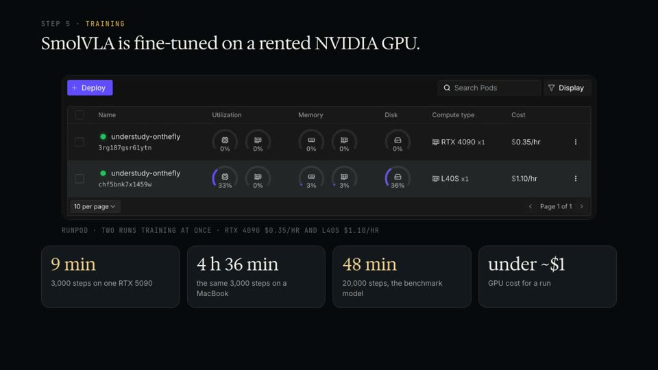

The same 3,000 steps take 9 minutes on one RTX 5090 and 4 h 36 min on a MacBook. All scores are in MuJoCo
simulation. Push, stack and tower learned from scripted demos, not Runway video, and their 5-start scores are rough.

## Budget routing (Runway Model Router)

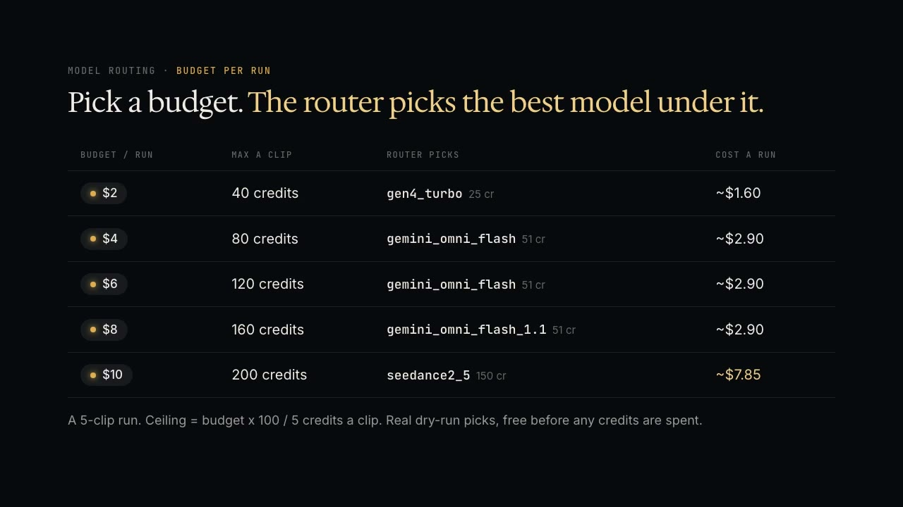

You don't pick a model; you pick what a run may cost. A run is 5 demonstration clips, and every budget is its own
**quality-optimized** Model Router with a price ceiling of `budget x 100 / 5` credits a clip
(`settings.maxCreditsPerGeneration.video`). The router picks the best model that fits. A free dry run shows the
pick and the price before any credit is spent.

| Budget per run | Router | Ceiling a clip | Model it picks | Credits a clip | Real run cost |
|---|---|---|---|---|---|
| $2 | `robohub-q40` | 40 | gen4_turbo (Runway) | 25 | about $1.60 |
| $4 | `robohub-q80` | 80 | gemini_omni_flash (Google) | 51 | about $2.90 |
| $6 | `robohub-q120` | 120 | gemini_omni_flash (Google) | 51 | about $2.90 |
| $8 | `robohub-q160` | 160 | gemini_omni_flash_1.1 (Google) | 51 | about $2.90 |
| $10 | `robohub-q200` | 200 | seedance2_5 (ByteDance) | 150 | about $7.85 |

Dry runs from 2026-09-30. Run cost includes the gen4_image first frames. 1 credit = $0.01.

## Prompting: PhyT2V

Prompts follow the PhyT2V loop (Xue et al., CVPR 2025) with Runway's Gen-4 guidance to phrase everything
positively. Each clip is judged by physics; when a clip fails (for example, the block duplicates itself halfway
through), the matching corrective rule in `src/rohub/plan.py` (`MISMATCH_RULES`) is added to the prompt and
the clip is regenerated. The overview on the site shows every Runway clip behind a robot, with its route and its
physics verdict, rejected ones included.

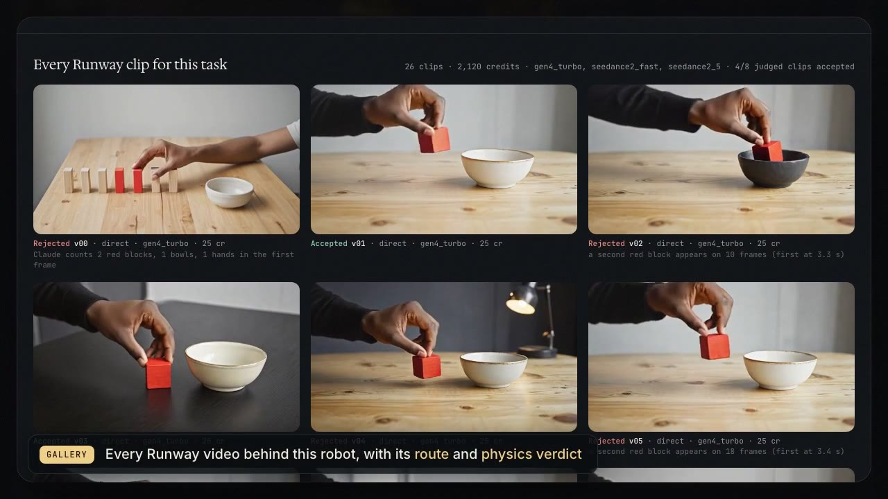

## Two ways to run it

### Hosted: bring your own Runway key

On the live site the finished tasks play for free. A new sentence runs on **your Gemini API key**:
paste it under the prompt. **Voice** opens a Gemini Live session: speak the task, and the agent calls `start_training` to fill the prompt and press Train. The key stays in this browser and is sent only to Google, through `site/api/cloud/`
(`start`, `video`, `task`, `media`). Gemini draws the first frame. Veo 3.1 Fast animates it under a $4 budget,
and Veo 3.1 animates it at $6 and above. The hosted site generates that clip live; the physics gates, retargeting
and SmolVLA training need the local pipeline below. Every Train, key or no key, first shows a scripted MuJoCo
preview of the sentence in the browser (`site/preview.js`: MuJoCo WebAssembly and three.js, no server); it is
scripted motion, not a learned policy. Gate telemetry for a connected Supabase project is on `/console/`.

### Local: the whole pipeline

Requirements: macOS (the keys live in the Keychain), Python 3.12 with [uv](https://docs.astral.sh/uv/), a Runway API key, and a RunPod
API key for GPU training.

```bash
uv sync
cp .env.example .env   # SUPABASE_URL, SUPABASE_SERVICE_ROLE_KEY, SUPABASE_ANON_KEY
security add-generic-password -s GEMINI_API_KEY -a "$USER" -w      # macOS Keychain (prompts for the key)
security add-generic-password -s RUNPOD_API_KEY -a "$USER" -w
bin/robohub serve                                              # http://127.0.0.1:8765
```

Apply `supabase/migrations/001_rohub_schema.sql` in the Supabase SQL editor once. That enables `vector`, the
`tasks` / `demonstrations` / `models` tables, and `search_similar_trajectories`. Each gate pass or fail is written
there, and accepted clips can store a 1536-d trajectory embedding.

`bin/robohub` reads the keys from the Keychain into the process environment only; they are never written to a
file. The local server serves the same site, with no key box, and runs every stage for real, streaming progress to
the page (Server-Sent Events):

1. **Runway:** first frames (gen4_image, then gen4_image_turbo restyles), then 5 s of motion through the budget's router.
2. **Physics:** hand tracking, a Claude scene audit, 21 gates, retargeting onto the SO-101 in MuJoCo, and a LeRobot v3.0 dataset.
3. **Training:** SmolVLA on the GPU you pick (4090, 5090, L40S, A100, H100) through RunPod (`gpu/rohub_trainer.py`); the pod is always terminated at the end, even on failure.
4. **Filming:** the trained policy runs each accepted scenario in MuJoCo, and the film becomes the tile.

Every tile keeps its own run time; click one for how its model was trained, a download link, and the Runway clips
behind it.

Command line:

```bash
bin/robohub run "put the red block in the bowl" --clips 7     # every stage, cached stage by stage
bin/robohub budget                                             # live Runway balance
scripts/train_vla_task.py data/probes/stack30 10000 --task stack --cameras front,wrist --eval-seeds 5
.venv/bin/python -m pytest                                        # tests
```

Re-running the same prompt spends nothing: Runway outputs are cached by request hash, and every paid call is a line
in `data/runway-ledger.jsonl` with the balance before and after.

## Pipeline and tools

| Stage | What | Tool |
|---|---|---|
| 1 prompt | parse the task and refuse what a 5-DOF two-finger arm can't do, before any credit is spent | `plan.py` |
| 2 lead | first frame, restyles, 5 s of motion through a budget router | Runway API: gen4_image, gen4_image_turbo, Model Router |
| 3 skeleton | 21 hand landmarks + arm pose per frame; the block by colour | MediaPipe Hand Landmarker + Pose, OpenCV |
| 4 audit | counts blocks, bowls and hands in the first frame, checks the last frame | Claude |
| 5 gates | 21 gates, clip side and robot side, each with a reason | `gates.py`, [docs/DATA-SPEC.md](docs/DATA-SPEC.md) |
| 6 retarget | grasp point to grasp point, 1:1 in metres, physics replay | MuJoCo 3, SO-101 MJCF |
| 7 dataset | accepted episodes with `so101_follower` keys and units | LeRobot 0.6.1, dataset format v3.0 |
| 7b check | every episode replayed in a second engine; flagged where they disagree | PyBullet |
| 8 policy | SmolVLA fine-tuned on camera + joints + sentence | `lerobot/smolvla_base`, RunPod GPUs |
| 9 rollout | the trained policy on unseen start positions, filmed for the tiles | MuJoCo |

### How a clip becomes robot data

- **Events come from the object.** The grasp is when the fingers reach the block just before it starts moving; the
  release is when the block is back at rest. Finger aperture is unreliable on generated hands
  ([docs/POSE-COMPARE.md](docs/POSE-COMPARE.md)).
- **Object-anchored.** While the block is held, the grasp point is the block's own measured centre. Before the grasp
  and after the release it is the hand's path, shifted so it meets the block exactly at the grasp.
- **The block is the ruler.** A 3 cm cube gives metres per pixel, so lift height and carry distance are the human's,
  in metres, on the robot. A thumb-index pinch maps to the SO-101's two-finger gripper.
- **Declared additions.** A reach from home, short settle and gripper times, 60 ms smoothing across joins, playback
  at half speed, and a return home. Each accepted clip is also replayed with the cube shifted by up to 3 cm, and
  every copy goes through the same robot gates.

## Honest limits

- Every result is in simulation. Nothing here has run on a physical SO-101 yet.
- Only the pick task is trained on Runway-derived demonstrations. Push, stack and tower use scripted-operator demos.
- Depth isn't measured: one camera can't see it, so each demonstration is assumed to stay in the plane of the block
  and the bowl.
- The Claude audit is a model's judgement on two stills; the pixel gates run independently of it.
- Stack and tower scores come from 5 unseen starts, so they're rough.

## Layout

```
src/rohub/        pipeline: plan, runway, generate, track, audit, gates, retarget, dataset, vla, web
site/             the site (index.html, site.css, site.js, preview.js, route.js, api/cloud/)
site/console/     Supabase gate matrix, trajectory search, joint preview
gpu/              RunPod client, SmolVLA trainer, task worker
scripts/          training, evaluation, benchmark, gallery and dataset tools
supabase/         schema, pgvector, realtime
vendor/so101/     SO-ARM100 MJCF (Apache-2.0)
```
